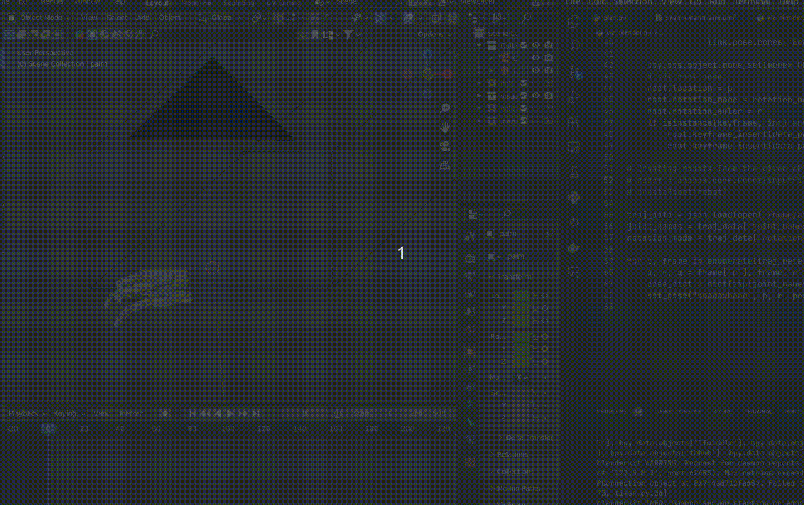

# Phobos Motion



This repo provides code snippets to animate robots imported with [Phobos](https://github.com/dfki-ric/phobos) in Blender. It uses Phobos 2.0.0 (Perilled Pangolin) and is compatible with Blender 3.x.

## Usage

First, follow the [Phobos Installation Guide](https://github.com/dfki-ric/phobos#installation) to set up Phobos 2. Our demo code has no other dependencies, but you can use `pip` under your Blender directory to install any extras needed. 

To run the demo:

1. Import a robot into Blender either manually or by running the Phobos import code. Note down the **robot name** (usually matches the name in the URDF/XML file).

2. Save the Blender file with the imported robot, e.g. `demo.blend`.

3. Run the demo script:

```shell
blender demo.blend -b --python demo.py
```

The demo script loads trajectory data from `data/demo_trajectory.json` which defines:

- `joint_names` specifies the **joint names** of the robot.
- `trajectory` tells the robot motion **trajectory** is a `list` of `dict`, each specifying robot state for one frame with keys:
   - `p`: Robot position.
   - `r`: Robot rotation as Euler angles.
   - `q`: Robot joint positions (`rad` for revolute, `m` for prismatic). 
- **Base rotation mode** - order of rotation for robot base 

The JSON file is generated by randomly sampling 100 robot poses. It provides a showcase for its format. Of note, the `joint_names` and the joint positions at each frame, `q`, are binded sequentially, thus they should have the same length.

> For clarity, the joint positions `q` here is in robotics context (specifying the joint angles or translations), rather than in 3D human context (specifying the positions of joints in the Cartesian coordinate.)

It then sets the robot pose each frame with `set_pose(...)`. Some key-word arguments:

- `ignore_limits` (default `False`) - whether to clip joint angles to limits
- `keyframe` (default `None`) - set keyframe on all bones if a positive integer

## Notes

This repo is a work in progress for my own research. More features and interfaces are planned.

We are also working on a website called ***Simulately*** (preview at [simulator-summary-dev.pages.dev](https://simulator-summary-dev.pages.dev/)) to help researchers quickly get info, code snippets, and solutions for simulators in vision and robotics. Stay tuned, and let me know if you would like to help!
